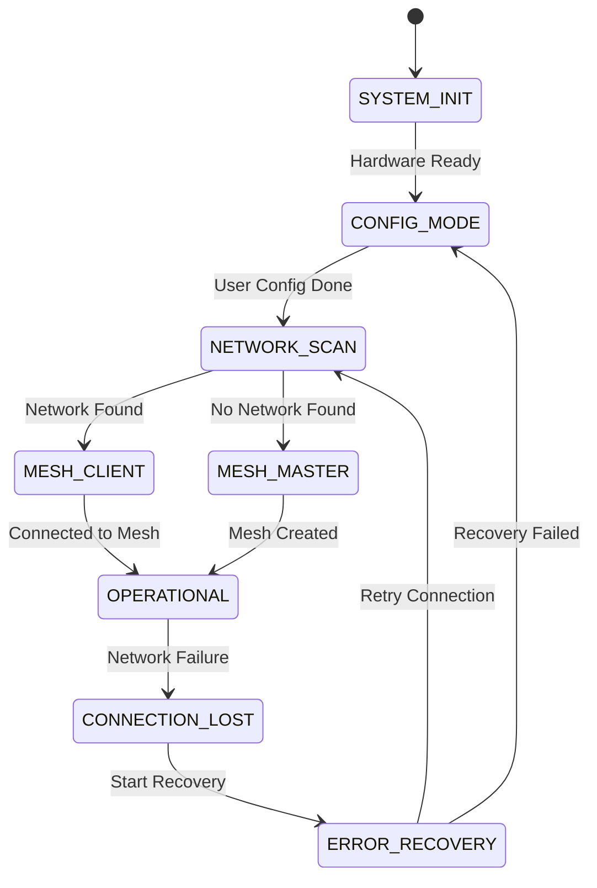

# KSB (Keya-Soft-Box) - Mesh LED Lighting System

[](https://opensource.org/licenses/MIT)
[](https://zephyrproject.org/)
[](https://www.espressif.com/)
[]()

A self-organizing mesh network LED lighting system built on ESP32 microcontrollers running Zephyr RTOS. KSB enables multiple LED lamps to automatically discover and connect to each other, creating synchronized lighting effects across an entire network.


## 🌟 Features

- **🔗 Automatic Mesh Networking**: Devices self-discover and form mesh networks
- **🎨 Synchronized LED Control**: Coordinated lighting effects across all connected devices
- **📱 Web Configuration**: Simple browser-based setup interface
- **🔋 Battery Monitoring**: Built-in power management and monitoring
- **🛡️ Self-Healing Network**: Automatic recovery from node failures  
- **⚡ Real-time RTOS**: Built on Zephyr RTOS for reliable operation
- **🎯 Multiple Board Support**: ESP32-S3, ESP32-C3, and XIAO variants

## 🚀 Quick Start

### Prerequisites

1. **Install Zephyr SDK**:
   ```bash
   cd your-workspace
   west init -m https://github.com/zephyrproject-rtos/zephyr --mr v3.4.0
   west update
   west blobs fetch hal_espressif
   ```

2. **Install ESP Tool**:
   ```bash
   pip3 install --user --upgrade esptool>=5.0.2 --break-system-packages
   export PATH=$HOME/.local/bin:$PATH
   ```

### Clone & Build

```bash
git clone https://github.com/your-org/keya-soft-box.git
cd keya-soft-box

# Build for ESP32-S3-DevKitM (default)
west build -b esp32s3_devkitm

# Or build for other supported boards:
# west build -b esp32c3_devkitm
# west build -b xiao_esp32c3

# Flash the firmware
west flash

# Monitor serial output
west build -t monitor
```

## 🔌 Hardware

### Supported Boards
- **ESP32-S3-DevKitM** - Primary development platform
### Soon Will Be
- **ESP32-C3-DevKitM** - Compact alternative
- **XIAO ESP32C3** - Ultra-small form factor

### Hardware Features
- **ESP32-S3/C3** microcontroller with WiFi
- **8x WS2812B** addressable LEDs
- **User button** with debouncing
- **Dual status LEDs** (Red/Green)
- **Battery monitoring** via ADC
- **Debug interface** (UART + SWD)
- **Power regulation** and filtering

### Pin Configuration
```
LED Strip:    GPIO11 (SPI2 MOSI) 
User Button:  GPIO0 (Pull-up, Active Low)
Status LEDs:  Red/Green with 220Ω resistors
Debug UART:   TX=GPIO43, RX=GPIO44
Power:        3.3V regulated with monitoring
```

## 📊 System Architecture

### Mesh Network States


### Key Components
- **Mesh Networking**: Self-organizing WiFi mesh with automatic node discovery
- **LED Control**: Synchronized WS2812B patterns across all network nodes  
- **Web Interface**: Browser-based configuration at `192.168.4.1` during setup
- **State Machine**: Robust state management with error recovery
- **NVS Storage**: Persistent configuration storage

## ⚙️ Configuration

### Device Tree Setup
The project includes board-specific overlays:

```c
// WS2812B LED strip configuration
&spi2 {
    led_strip: ws2812@0 {
        compatible = "worldsemi,ws2812-spi";
        chain-length = <8>;
        spi-max-frequency = <4000000>;
        color-mapping = <LED_COLOR_ID_GREEN>,
                        <LED_COLOR_ID_RED>, 
                        <LED_COLOR_ID_BLUE>;
    };
};
```

### Kconfig Options
Key configuration options in `prj.conf`:
```
CONFIG_WS2812B_STRIP=y
CONFIG_WS2812B_MAX_PIXELS=256
CONFIG_NETWORKING=y
CONFIG_WIFI=y
CONFIG_HTTP_SERVER=y
CONFIG_NVS=y
```

## 🎮 Usage

### Initial Setup
1. **Power on** the device - it creates a WiFi access point `KSB_Setup_XXXX`
2. **Connect** to the AP and navigate to `192.168.4.1`
3. **Configure** your mesh network name (e.g., "Living Room")
4. **Save** configuration - device will restart and search for existing networks

### Network Formation
- **First device**: Creates new mesh network as root node
- **Additional devices**: Automatically discover and join existing mesh
- **Status indication**: LEDs show current state (scanning, connecting, operational)

### LED Control
- **Synchronized patterns** across all connected devices
- **Button control** for basic pattern switching
- **Web interface** for advanced pattern configuration
- **Mesh broadcast** ensures all nodes stay synchronized

## 🛠️ Development

### Project Structure
```
keya-soft-box/
├── boards/                 # Board-specific overlays
├── dts/                    # Device tree sources
├── Housing/                # Housing 3d models for print 
├── include/                # Version include
├── modules/                # modules.cmake
├── src/                    # Application source
│   ├── main.c             # Main application
│   ├── mesh_network.c     # Mesh networking logic
│   ├── led_control.c      # LED pattern control
│   └── web_config.c       # Web configuration
├── Wiring/                 # Schematic for KSB
├── ws2812/                 # WS2812 custom driver 
├── CMakeLists.txt          # Build configuration
├── Kconfig                 # Config options
├── KSB.code-workspace      # VS-code workspace
├── LICENSE                 # License file
├── prj.conf                # Project config
├── README.md               # this doc
└── west.yml                # file for west update
```

### Building for Different Boards

```bash
# ESP32-S3-DevKitM (recommended)
west build -b esp32s3_devkitm

# ESP32-C3-DevKitM  
west build -b esp32c3_devkitm

# XIAO ESP32C3
west build -b xiao_esp32c3
```

### Custom LED Patterns
Add new patterns in `src/led_control.c`:
```c
void pattern_custom(struct led_rgb *leds, uint32_t frame) {
    // Your custom pattern implementation
    for (int i = 0; i < LED_STRIP_LENGTH; i++) {
        leds[i] = (struct led_rgb){
            .r = /* red value */,
            .g = /* green value */,
            .b = /* blue value */
        };
    }
}
```

## 🧪 Testing

### Hardware Testing
- [ ] Power supply regulation (3.3V ±5%)
- [ ] All 8 WS2812B LEDs functional
- [ ] Button input with proper debouncing
- [ ] UART debug communication
- [ ] WiFi connectivity and range

### Software Testing  
- [ ] State machine transitions
- [ ] Mesh network formation (2-8 nodes)
- [ ] LED pattern synchronization
- [ ] Network recovery after node failure
- [ ] Configuration persistence

### Performance Targets
- **Mesh formation**: < 60 seconds for 8 nodes
- **LED update rate**: 30 FPS
- **Network recovery**: < 10 seconds  
- **Power consumption**: < 500mA @ 3.3V per node
- **Range**: 10-30m indoor, 50-100m outdoor

## 🐛 Troubleshooting

### Common Issues

**Build Errors**
```bash
# Ensure Zephyr SDK is properly installed
west --version
which esptool.py

# Clean and rebuild
west build -t clean
west build
```

**Flash Errors**
```bash
# Check USB connection and permissions
ls -la /dev/ttyUSB* /dev/ttyACM*

# Try different baud rate
west flash --baud 115200
```

**WiFi Connection Issues**
- Check antenna connection
- Verify 2.4GHz WiFi support
- Ensure regulatory domain settings
- Test in different locations for interference

**LED Problems**  
- Verify 3.3V power supply stability
- Check WS2812B data line continuity
- Ensure proper GND connection
- Test with simple solid color first

### Debug Output
Enable detailed logging in `prj.conf`:
```
CONFIG_LOG=y
CONFIG_LOG_DEFAULT_LEVEL=4
CONFIG_MESH_NETWORK_LOG_LEVEL_DBG=y
```

## 📚 API Documentation

### Mesh Network API
```c
// Initialize mesh networking
int mesh_network_init(const char *network_name);

// Join or create mesh network
int mesh_network_start(void);

// Send LED command to all nodes
int mesh_broadcast_led_command(struct led_command *cmd);
```

### LED Control API
```c
// Set LED pattern for entire strip
int led_set_pattern(enum led_pattern pattern, struct led_rgb color);

// Update single LED
int led_set_pixel(int index, struct led_rgb color);

// Apply changes to physical LEDs
int led_update_strip(void);
```

## 🤝 Contributing

We welcome contributions! Please see our [Contributing Guide](CONTRIBUTING.md) for details.

### Development Workflow
1. **Fork** the repository
2. **Create** a feature branch (`git checkout -b feature/amazing-feature`)
3. **Commit** your changes (`git commit -m 'Add amazing feature'`)
4. **Push** to the branch (`git push origin feature/amazing-feature`)
5. **Open** a Pull Request

### Code Style
- Follow Zephyr coding conventions
- Use descriptive variable and function names
- Add comments for complex algorithms
- Include unit tests for new features

## 📋 Roadmap

### Version 1.1 (Q2 2025)
- [ ] Mobile app for remote control
- [ ] Advanced LED patterns and effects
- [ ] Energy-saving sleep modes
- [ ] Over-the-air (OTA) firmware updates

### Version 2.0 (Q4 2025)  
- [ ] Battery-powered operation
- [ ] Environmental sensors integration
- [ ] Music synchronization
- [ ] Cloud connectivity and control

### Hardware V2.0
- [ ] Integrated battery and charging
- [ ] Temperature and light sensors
- [ ] Audio output for notifications
- [ ] Compact PCB design

## 📄 License

This project is licensed under the MIT License - see the [LICENSE](LICENSE) file for details.

## 🙏 Acknowledgments

- **Zephyr Project** - For the excellent RTOS foundation
- **Espressif** - For ESP32 hardware and support
- **WS2812B Community** - For LED strip driver inspiration
- **Contributors** - Everyone who helps improve this project

## 📞 Support

- **Issues**: Report bugs and request features on [GitHub Issues](https://github.com/ArturR0k3r/KeyaSoftbox/issues)
- **Email**: Contact the maintainers at artur@pen.engineering

---

**⭐ Star this repo if you find it useful!**

